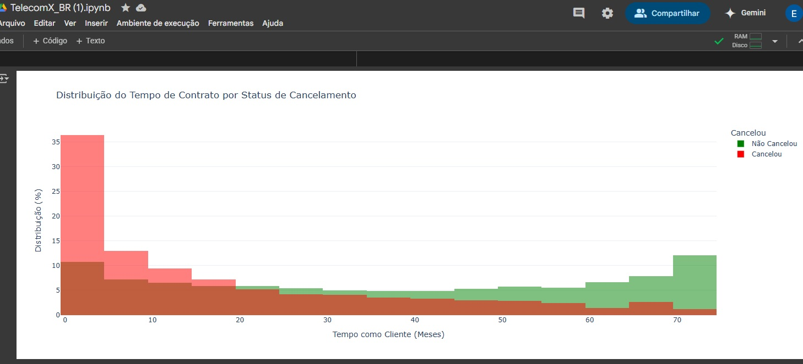

Jupiter Telecom X: Análise de Evasão de Clientes (Churn)

Olá! Seja bem-vindo(a) ao repositório do projeto Telecom X, um desafio de Data Science do Programa ONE da Alura. Este projeto foca na análise de evasão de clientes, também conhecida como churn, para ajudar a Telecom X, uma empresa de telecomunicações, a entender e reduzir sua alta taxa de saída de clientes.

O Desafio
A Telecom X enfrenta um problema significativo de evasão de clientes e não consegue identificar as causas. Como assistente de análise de dados, fui encarregado(a) de uma das partes mais críticas desse processo: a extração, transformação e análise exploratória dos dados (ETL e EDA). Meu objetivo principal é preparar dados limpos e tratados, a partir dos quais a equipe de Data Science poderá construir modelos preditivos eficazes para diminuir a taxa de churn.

Estrutura do Projeto
Este repositório contém o trabalho desenvolvido na fase de ETL e EDA do projeto Telecom X. O desafio envolveu as seguintes etapas:

Extração de Dados (Extract): A parte mais importante. Os dados da empresa estão em uma API hospedada em um repositório no GitHub. O primeiro passo foi descobrir a melhor forma de extrair esses dados.
Transformação de Dados (Transform): Após a extração, os dados foram transformados e limpos para garantir a qualidade e a consistência, tornando-os adequados para a análise.
Análise Exploratória de Dados (EDA): Realizei uma análise exploratória aprofundada dos dados tratados. Esta etapa incluiu a identificação de padrões, tendências e insights iniciais sobre o comportamento dos clientes, utilizando gráficos e visualizações.
Relatório Final
Como parte do desafio, um relatório detalhado foi gerado, cobrindo todo o processo de ETL e EDA. Este relatório inclui:

Introdução: Apresentação do objetivo da análise e do problema da evasão de clientes na Telecom X.
Processo de Importação, Limpeza e Tratamento de Dados: Descrição passo a passo de como os dados foram importados, limpos e transformados.
Análise Exploratória: Detalhamento dos achados da análise exploratória, incluindo gráficos e visualizações que ajudam a identificar padrões e possíveis causas de churn.
Conclusão: Resumo dos principais insights obtidos e como eles podem ser usados para ajudar a equipe de Data Science a reduzir a evasão de clientes.
Sugestões: Recomendações baseadas nas análises para apoiar ainda mais a equipe da Telecom X.
Tecnologias Utilizadas
Este projeto foi desenvolvido utilizando Python e suas bibliotecas nativas, com destaque para:

Pandas: Para manipulação e análise de dados.
Seaborn: Para visualização estatística de dados.
Matplotlib: Para criação de gráficos e visualizações personalizadas.
